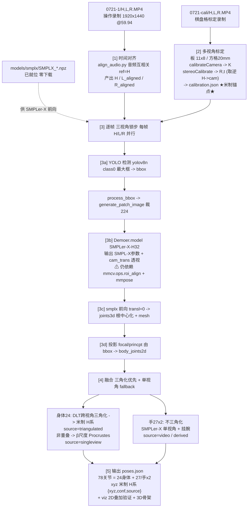

# Pose3D Pipeline — 技术流框图

> 状态：里程碑 2.6 锁定后（Linux + RTX 5080 / Blackwell）。
> 输入：3 路头戴相机视频 → 输出：逐帧 **78 关节米制 3D** `poses.json`（24 身体 + 27/手×2）。
> 配套：`DESIGN_LOCKED.md`（决策记录）、`README.md`（跑通步骤）、`BODY_HAND_MAP.md`（关节映射）。

---

## 框图（ASCII）

```
                 输入 INPUTS
   dataset/Ego4WholeBody/
     0721-1/{H,L,R}.MP4   1920×1440 HEVC @59.94fps  (操作录制)
     0721-cali/{H,L,R}.MP4                        (棋盘格标定录制)
     models/smplx/SMPLX_*.npz                      (已就位,零下载)
                 │
   ┌─────────────┴───────────────────┐
   ▼                                 ▼
┌────────────────────┐    ┌─────────────────────────────┐
│ [1] 时间对齐        │    │ [2] 多视角标定 (米制锚点)    │
│  复用 align_audio.py│    │  从 0721-cali,板 11×8/sq20mm│
│  音频互相关 ref=H   │    │  findChessboardCornersSB    │
│  ─────────────────  │    │  calibrateCamera → K_v      │
│  → H(原样)          │    │  stereoCalibrate(H,L)/(H,R) │
│  → L_aligned.MP4    │    │   R,t (存为 other→H)        │
│  → R_aligned.MP4    │    │  build_proj_mat 取逆 →H→cam │
│  + audio_align.json │    │  ─────────────────────────  │
└─────────┬──────────┘    │  → calibration.json         │
          │               │     ★20mm钉死真实米制★      │
          │               └──────────────┬──────────────┘
          └──────────────┬───────────────┘
                         ▼
   ╔══════════════════════════════════════════════════════════╗
   ║ [3] 逐帧·三视角锁步 (对齐后 H/L/R 同帧号并行)            ║
   ║   for v in {H,L,R}:                                      ║
   ║                                                          ║
   ║   RGBᵥ ─▶[3a] YOLO 检测 (yolov8n, class0, 最大框)        ║
   ║            │ bboxᵥ                                       ║
   ║            ▼                                             ║
   ║          process_bbox → generate_patch_image(裁224)      ║
   ║            │                                             ║
   ║            ▼                                             ║
   ║         [3b] Demoer.model({'img':..}, 'test')            ║
   ║            │ ← SMPLer-X-H32 (ViT-H 回归器)               ║
   ║            │   ⚠ 仍 import mmcv.ops.roi_align + mmpose   ║
   ║            ▼                                             ║
   ║          SMPL-X 参数 + cam_trans(透视,非 pred_cam)       ║
   ║            │                                             ║
   ║            ▼                                             ║
   ║         [3c] smplx 前向(transl=0)                        ║
   ║            │ → joints3d(根中心化) + mesh(指尖)           ║
   ║            ▼                                             ║
   ║         [3d] 投影: focal/princpt 由 bbox 算              ║
   ║            → body_joints2d (原图像素,供三角化)          ║
   ║                                                          ║
   ║   per_view[v] = {body2d, joints3d, betas, det_score}     ║
   ╚══════════════════════════════════════════════════════════╝
                         │
                         ▼
   ┌──────────────────────────────────────────────────────────┐
   │ [4] 融合 (三角化优先 + 单视角 fallback)                   │
   │                                                          │
   │  身体 24:                                                │
   │    跨 H/L/R 的 body2d + 标定 K,[R|t] → DLT 三角化        │
   │      → 米制 3D,H 参考系         source=triangulated      │
   │    FOV 非重叠/<2 视角 → β尺度单视角 + Procrustes 对齐    │
   │      → (近似)                    source=singleview       │
   │                                                          │
   │  手部 27×2: (太小,不三角化)                              │
   │    SMPLer-X 手 15+腕 → 26→27 名                          │
   │      (tip 默认外推, *_Extra/Palm_Center 补全)            │
   │    Procrustes 挂到三角化身体 + 腕 snap                   │
   │      →                            source=video/derived   │
   └──────────────────────────┬───────────────────────────────┘
                              ▼
   ┌──────────────────────────────────────────────────────────┐
   │ [5] 输出                                                 │
   │   poses.json  78 关节 = 24 身体 + 27/手 ×2               │
   │     xyz 米制(米), H 相机系;  每点 {xyz, conf, source}    │
   │   viz/  2D 叠加(=投影约定验证) + 3D 骨架自检             │
   └──────────────────────────────────────────────────────────┘
```

---

## 框图（Mermaid，GitHub 可渲染）



---

## 各阶段要点

| 阶段 | 模块 | 干什么 | 关键产出 |
|---|---|---|---|
| **[1] 时间对齐** | `io/time_align.py` → `Data_Preprocessing/align_audio.py` | 音频互相关，H 为参考，trim L/R | `H` / `L_aligned.MP4` / `R_aligned.MP4` + `audio_alignment.json` |
| **[2] 标定** | `calib/checkerboard.py` + `calib/multicam_calib.py` | 棋盘格 11×8 / 20mm；单目内参 K + stereoCalibrate 刚性相对外参 R,t（存 other→H，`build_projection_matrices` 取逆得 H→cam） | `calibration.json`（**米制锚点**） |
| **[3a] 检测** | wrapper 内 `ultralytics YOLO` | yolov8n，class 0，最大 person 框 | `bbox`（已替代 mmdet faster_rcnn） |
| **[3b] 回归** | wrapper `Demoer.model`（SMPLer-X-H32） | 裁 224 → 回归 SMPL-X 参数 + `cam_trans`（透视，非 pred_cam） | SMPL-X params + cam_trans |
| **[3c] 前向** | wrapper `_smplx_forward`（vchoutas smplx） | transl=0 → 根中心化 joints3d + mesh（指尖） | `joints3d_smplx`、`verts_smplx` |
| **[3d] 投影** | wrapper `_project_to_pixels` | focal/princpt 由 bbox 算 → 透视投影 | `body_joints2d`（原图像素） |
| **[4] 身体融合** | `fuse/view_selector.py` + `triangulate/dlt.py` | DLT 跨视角三角化 → 米制 H 系；非重叠 → β尺度 + Procrustes 单视角 | 24 身体（source=triangulated / singleview） |
| **[4] 手部融合** | `fuse/hand_attach.py` + `hand/smplx_hand_mapping.py` | 手不三角化；SMPLer-X 15+腕→27；Procrustes 挂身体 + 腕 snap | 27/手（source=video / derived） |
| **[5] 输出** | `io/pose_writer.py` + `viz/skeleton_viewer.py` | 序列化逐帧 78 关节；2D 叠加验证 + 3D 骨架 | `poses.json` + `viz/` |

---

## 关键事实

- **米制来源**：[2] 的棋盘格 20mm 是整条线唯一的真实尺度锚点；身体靠多视角 DLT 三角化直接拿到米制全局 3D（H 参考系，单位米）。
- **检测器 vs 回归器**：检测已换成 YOLO（mmdet 移除）；回归器仍是 SMPLer-X-H32，且**硬依赖 `mmcv.ops.roi_align` + transformer_utils(mmpose)** —— 这块在 5080/Blackwell 上需走 A（源码编译 mmcv-full）或 B（torchvision roi_align shim），是当前唯一未落地点（见 README §9）。
- **手部**：太小不进三角化，靠 SMPLer-X 单视角 + 挂到三角化腕；`source` 如实标注。
- **投影约定**：`cam_trans` 透视（focal/princpt 由 bbox 算），非弱透视 pred_cam；需在样本帧用 `viz/H_*.png` 目视确认骨架落在人身上（README §8）。

## 逐关节 `source` 字段

| source | 含义 |
|---|---|
| `triangulated` | 跨视角 DLT → 米制 3D（身体，H 系） |
| `singleview` | 最优单视角 SMPLer-X，β尺度（近似） |
| `video` | 直接来自逐视角模型（SMPLer-X / HaMeR） |
| `derived` | 由其它关节插值/取重心（`*_Extra`、`Palm_Center`、默认 tip 外推） |
| `hamer` | 可选 HaMeR 手部后端 |
| `missing` | 本帧未恢复 |
